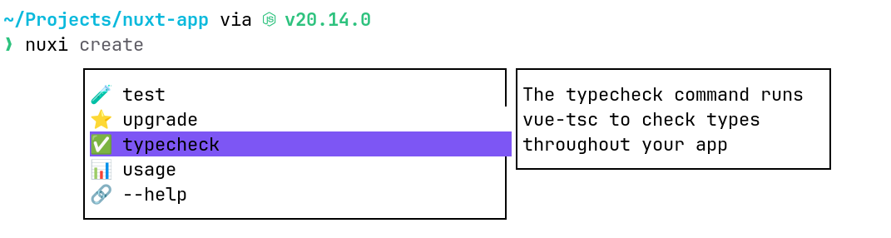
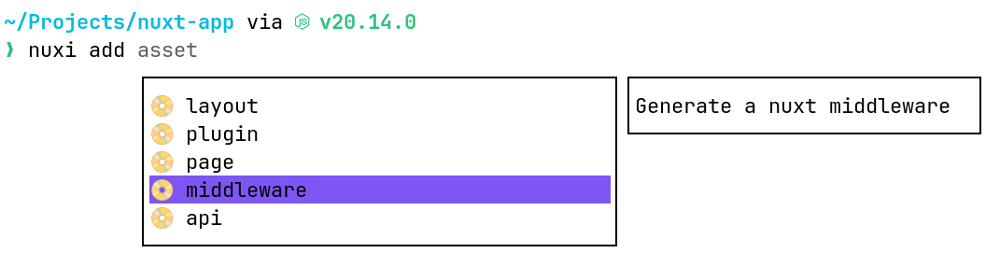
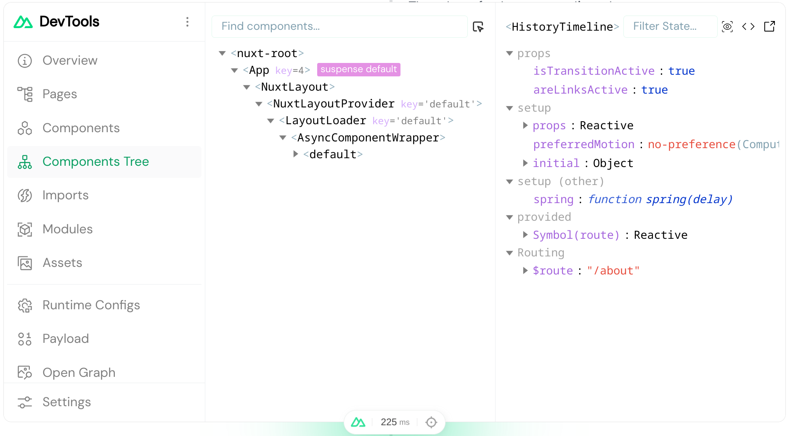
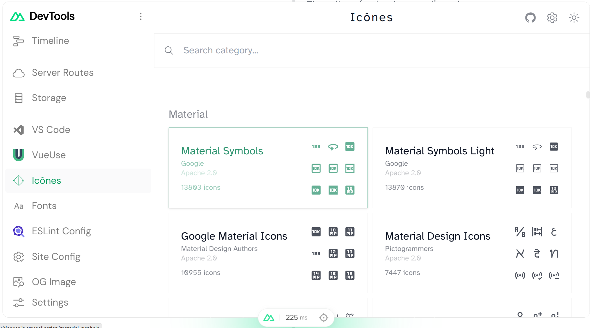
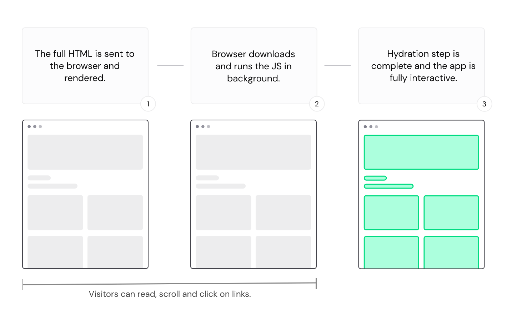
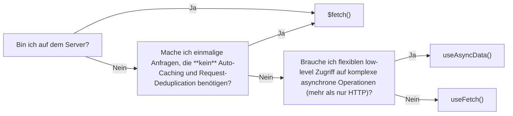
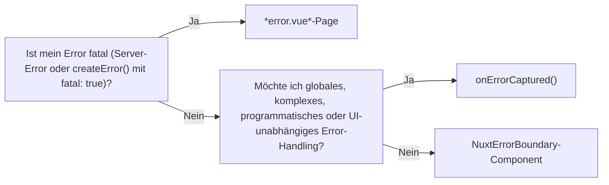

# Nuxt 3

- kompletter Rewrite
- basiert auf vielen eigenen Implementierungen
    - `nitro`: Server engine, überall deploybar, rendert Seiten, cached usw.
    - `h3`: HTTP-Framework, kompatibel mit jeder Runtime
    - `ofetch`: API-Wrapper, isometrisch fetchen
- Nuxi (neue CLI) und Nuxt Dev Tools
- überall einsetzbar, Rendering dynamisch (Client-side, Server-side, Hydration)
- überall Hot-reload

---
transition: fade-out
---

# Nuxi CLI

- viele komfortable Befehle wie das Generieren von Strukturen




---
transition: fade-out
---

# Nuxt Dev Tools

- ersetzt Vue Dev Tools
- eigenes Package statt Browser-Extension
- Nuxt Modules und co. direkt in Dev Tools integriert




---
transition: fade-out
---

# Routing

- optimiertes Routing mit `<NuxtLink>` (statt `<a>`) und `navigateTo()` (in JS)
- Rendering, Caching und Co. konfigurierbar

```ts
export default defineNuxtConfig({
  routeRules: {
    // Homepage pre-rendered at build time
    '/': { prerender: true },
    // Products page generated on demand, revalidates in background, cached until API response changes
    '/products': { swr: true },
    // Product pages generated on demand, revalidates in background, cached for 1 hour (3600 seconds)
    '/products/**': { swr: 3600 },
    // Blog posts page generated on demand, revalidates in background, cached on CDN for 1 hour (3600 seconds)
    '/blog': { isr: 3600 },
    // Blog post page generated on demand once until next deployment, cached on CDN
    '/blog/**': { isr: true },
    // Admin dashboard renders only on client-side
    '/admin/**': { ssr: false },
    // Add cors headers on API routes
    '/api/**': { cors: true },
    // Redirects legacy urls
    '/old-page': { redirect: '/new-page' }
  }
})
```

<arrow v-click x1="450" y1="450" x2="330" y2="445" color="red" width="2" arrowSize="1" />

---
transition: fade-out
---

# Spezifisches Rendering

- Kann auf Component- und Template-Ebene definiert werden

```
/components/ExampleComponent.client.vue
/components/ExampleComponent2.server.vue
```

```vue
<template>
  <div>
    <!-- This renders the "span" element on the server side -->
    <ClientOnly fallbackTag="span">
      <!-- this component will only be rendered on client side -->
      <Comments />
      <template #fallback>
        <!-- this will be rendered on server side -->
        <p>Loading comments...</p>
      </template>
    </ClientOnly>
  </div>
</template>
```

---
transition: fade-out
---

# Hydration (Best of both worlds)

- SSR für schnelles & initiales Anzeigen der Seite (auch gut für SEO und Accessibility)
- Im Hintergrund wird JS geladen
- Hydration: JS wird injiziert und App wird interaktiv & reaktiv wie eine SPA



---
transition: fade-out
---

# Hydration (Best of both worlds)

- kann zu Mismatches führen
  - z.B. Zeitanzeige initial mit Server-Zeit und nach Hydration mit User-Client-Zeit
  - fehlerhafter Zustand und Interaktivität, Verlust von Performance
- Per Standard aktiviert (Universal Rendering)
- kann per Route Rules oder mit `ssr: false` deaktiviert werden

---
transition: fade-out
---

# Nuxt Server als Backend

- Plugins, Middleware und Routes (Controller Endpoints) können auf Serverseite implementiert werden

```ts
// /server/routes/api/users/[id].get.ts
export default defineEventHandler((event) => {
  const id = getRouterParam(event, 'id')

  return `Hello, user with id ${id}!`
})
```

```vue
<script setup lang="ts">
  // /pages/index.vue
  const { data } = await useFetch('/api/users/42')
</script>
```

---
transition: fade-out
---

# Fetch

- `$fetch()` ist isometrisches `fetch()`
- für einmalige Requests wie z.B. beim Klick auf einen Button
- für Requests auf Serverseite
- kein Auto-caching oder Request-deduplication von Nuxt
  - mehrere gleiche & gleichzeitige Requests würden alle ausgeführt werden

<br />

```ts
return await $fetch("https://api.example.invalid/users/12", {
  method: "DELETE",
})
```

---
transition: fade-out
---

# Fetch

<div class="grid grid-cols-2 gap-sm">

- `useAsyncData()`-Composable wie früher `asyncData`
- Nur im Vue-Context
- Für komplexes Fetchen (oder andere async. Logik)
- Mit Auto-caching und Request-deduplication von Nuxt
  - mehrere gleiche & gleichzeitige Requests würden nur einmal ausgeführt werden

```vue
<script setup>
const { data, status, error, refresh, clear } = 
  await useAsyncData(
    'user', // Optional: Unique key
    async () => {
      // Custom fetch logic
      const [posts, followers, activity] = 
        await Promise.all([
          $fetch(`/api/users/${userId.value}/posts`),
          $fetch(`/api/users/${userId.value}/followers`),
          $fetch(`/api/users/${userId.value}/activity`)
        ])
      return { posts, followers, activity }
    },
    {
      // Optional: refresh on route changes
      watch: [/* reactive dependencies */],
      // Optional: lazy loading
      lazy: false
      // ...
    }
  )
</script>
```

</div>

---
transition: fade-out
---

# Fetch

<div class="grid grid-cols-3 gap-sm">

<div class="col-span-1">

- `useFetch()`-Composable kombiniert `useAsyncData()` & `$fetch()`
- Nur im Vue-Context
- Nur für HTTP-Requests
- Simpler & automatisch reaktiv

</div>
<div class="col-span-2">

```vue
<script setup>
const page = ref(1)
const pageSize = ref(10)

const { data: photos, pending, error, refresh } = 
  await useFetch("/api/photos", {
    // Optional: set a key for caching
    key: `photos-${toValue(page)}-${toValue(pageSize)}`,
    // Optional: set query params
    params: { page, pageSize },
    // Optional: transform the response
    transform: (response) => response.photos,
    // ...
  })

function nextPage() {
  page.value++
}
</script>
```

</div>
</div>

---
transition: fade-out
layout: items
---

# Fetch

Wann was nutzen?



---
transition: fade-out
---

# Exception Handling

- `error.vue`-Page bei fatalem Error

```vue
<script setup lang="ts">
import type { NuxtError } from '#app'

const props = defineProps({
  error: Object as () => NuxtError
})

const handleError = () => clearError({ redirect: '/' })
</script>

<template>
  <div>
    <h2>{{ error.statusCode }}</h2>
    <button @click="handleError">Clear errors</button>
  </div>
</template>
```

---
transition: fade-out
---

# Exception Handling

- Error selbst werfen mit `createError()`

```vue
<script setup lang="ts">
const route = useRoute()
const { data } = await useFetch(`...`)

if (!data.value) {
  throw createError({
    statusCode: 404,
    statusMessage: 'Page Not Found'
  })
}
</script>
```

---
transition: fade-out
---

# Exception Handling

- Vues `onErrorCaptured()`-Composable zum programmatischen Catchen von Errors

```vue
<script setup>
onErrorCaptured((error, instance, info) => {
  // Global error logging that catches everything
  console.error(`Global error: ${error.message}`)
  console.log(`Error occurred in component:`, instance)
  console.log(`Error info:`, info)

  // Let the error continue to propagate to UI boundaries
  return true
})
</script>
```
---
transition: fade-out
---

# Exception Handling

- `<NuxtErrorBoundary>` zum Catchen von Errors im UI
- Nutzt `onErrorCaptured()`-Composable intern

```vue
<template>
  <NuxtErrorBoundary @error="someErrorLogger">
    <!-- Put normal content here for no error case -->
    <template #error="{ error, clearError }">
      Oh no, an error occurred: {{ error }}
      <button @click="clearError">
        Ignore and continue
      </button>
    </template>
  </NuxtErrorBoundary>
</template>
```

---
transition: fade-out
layout: items
---

# Exception Handling

Wann was verwenden?



---
transition: fade-out
layout: quote
---

# [Empfohlene Modules](https://nuxt.com/modules)

<div class="grid place-items-center h-full">
<div class="w-100 text-sm text-left mt-4">

| **Offiziell**          | **Third-party**  |
|------------------------|------------------|
| Nuxt Dev Tools (Config) | VueUse Nuxt      |
| Nuxt Image             | Pinia Nuxt       |
| Nuxt Icon              | TailwindCSS Nuxt |
| Nuxt Fonts             | Nuxt i18n        |
| Nuxt ESlint            | Nuxt Security    |
| Nuxt Test utils        |                  |

</div>
</div>
